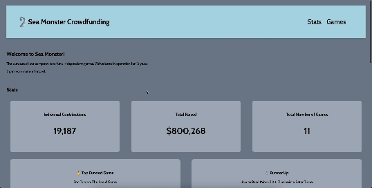

# WEB102 Prework - *SeaMonster CrowdFunding Games*

Submitted by: **Ruhi Sawant**

**SeaMonster CrowdFunding Games** is a website for the company Sea Monster Crowdfunding that displays information about the games they have funded.

Time spent: **3** hours spent in total

## Required Features

The following **required** functionality is completed:

* [x] The introduction section explains the background of the company and how many games remain unfunded.
* [x] The Stats section includes information about the total contributions and dollars raised as well as the top two most funded games.
* [x] The Our Games section initially displays all games funded by Sea Monster Crowdfunding
* [x] The Our Games section has three buttons that allow the user to display only unfunded games, only funded games, or all games.

The following **optional** features are implemented:

* [x] A search bar for filtering games dynamically.
* [x] Updated CSS and enhanced styling for a polished look.
* [x] Responsive design ensuring compatibility across smaller devices.
* [x] A user-friendly navigation bar for improved accessibility and ease of use.

## Video Walkthrough

Here's a walkthrough of implemented features:

GIF created with ...  [Adobe Express](https://www.adobe.com/express/feature/video/convert/mov-to-gif)

## Notes  

While building this app, I encountered a few challenges:  

- **Dynamic Filtering:** Implementing the search bar to dynamically filter games and ensuring the displayed results updated seamlessly without requiring a page reload.  
- **Data Handling:** Parsing and manipulating JSON data to accurately display game details, such as contributions and funding status, in an intuitive and clean manner.  

These challenges helped sharpen my technical skills, particularly in JavaScript and DOM manipulation.  

## License

    Copyright 2024 Ruhi Sawant

    Licensed under the Apache License, Version 2.0 (the "License");
    you may not use this file except in compliance with the License.
    You may obtain a copy of the License at

        http://www.apache.org/licenses/LICENSE-2.0

    Unless required by applicable law or agreed to in writing, software
    distributed under the License is distributed on an "AS IS" BASIS,
    WITHOUT WARRANTIES OR CONDITIONS OF ANY KIND, either express or implied.
    See the License for the specific language governing permissions and
    limitations under the License.
